# FTEC5660 Homework 1: Receipt Chain

Build a LangChain pipeline that reads every supermarket receipt in a folder
with the vision-capable DeepSeek Flash model and answers these two questions:

1. How much money did I spend in total for these bills?
2. How much would I have had to pay without the discount?

For this homework, **amount spent** means the final payment after the receipt's
rounding line. **Without the discount** means the sum of the original positive
item prices: add back every promotion, coupon, member, app, packaging-damage,
and percentage discount, but do not add back rounding.

## Student task

Only edit the two functions in `hw1.py` that contain `### YOUR CODE HERE`:

- `build_chain()` creates your LangChain chain.
- `answer_queries()` runs the chain on the receipt images and returns one final
  response for each question.

You may use prompt chaining, routing, parallel calls, reflection, or a
combination. Your final responses should each contain one HKD amount. Do not
hard-code filenames or public answers; grading uses unseen receipt folders.

## Setup and public test

```bash
python3 -m venv .venv
source .venv/bin/activate
pip install -r requirements.txt
```

Put your DeepSeek key after `DEEPSEEK_API_KEY=` in `.env`, then run:

```bash
python3 hw1.py --image-folder public_test
```

The program creates `results.csv` in the current directory. Its columns are
`query`, `model_response`, and `correctness`. The public answers are in
`public_test/ground_truth.json`. The starter intentionally returns the dummy
response `please design your chain to answer these two queries.` so it runs
before you add any API code.

The required model is `deepseek-v4-flash-vision-exp`, the vision-capable
DeepSeek Flash model. JPEG, PNG, GIF, and WebP inputs are accepted by the
homework runner.


## Homework 1 solution: 
> to students: please fill your solution description here.

## System Architecture

```mermaid
flowchart LR
    A["Receipt Images"] --> B["Vision Extraction"]
    B --> C["JSON Parsing"]
    C --> D["Validation & Calculation"]
    D --> E["Aggregate Answers"]
    E --> F["results.csv"]

    style A fill:#eff6ff,stroke:#93c5fd,color:#1e3a8a
    style B fill:#f5f3ff,stroke:#c4b5fd,color:#5b21b6
    style C fill:#f5f3ff,stroke:#c4b5fd,color:#5b21b6
    style D fill:#ecfdf5,stroke:#6ee7b7,color:#065f46
    style E fill:#eff6ff,stroke:#93c5fd,color:#1e3a8a
    style F fill:#f8fafc,stroke:#94a3b8,color:#334155
```



The pipeline uses a vision model to extract receipt data and Python to validate and calculate monetary values.

1. **Prepare images:** Sort receipt images and encode them as Base64 data URLs.
2. **Extract and parse:** Use a LangChain vision prompt to extract `paid`, `subtotal`, `rounding`, and `discounts`, then parse the response as JSON.
3. **Validate and calculate:** Convert amounts to `Decimal` and verify `paid = subtotal + rounding`. Eligible extraction or validation errors trigger a retry, with at most two attempts.
4. **Aggregate and export:** Process up to three receipts concurrently, sum the results, and write the answers to `results.csv`. An optional `ground_truth.json` provides reference answers for grading.

### Answer Calculation

| Question | Calculation |
| --- | --- |
| Total money spent | Sum of `paid` across all receipts |
| Total without discounts | Sum of `subtotal + sum(abs(discount amounts))` across all receipts |

**Note:** `subtotal` is the amount after discounts but before rounding. The amount without discounts is therefore calculated before rounding; payment rounding is not reapplied.

### Processing Pipeline

1. **Prepare inputs.** Read supported images from the specified folder, sort them by filename, and encode each image as a Base64 data URL.
2. **Extract amounts.** Combine the receipt image with extraction instructions using `ChatPromptTemplate`. The configured `ChatDeepSeek` model (`deepseek-v4-flash-vision-exp`, `temperature=0`) extracts the final payment, discounted subtotal, rounding adjustment, and individual discounts. `JsonOutputParser` converts the response into structured data.
3. **Validate and compute.** Convert monetary values to `Decimal` with two decimal places, validate the data structure, and verify that `paid = subtotal + rounding`. Compute each receipt’s amount before discounts by adding the absolute discount amounts back to its subtotal. Eligible parsing or validation failures trigger a retry of the full chain, with at most two attempts. An unrecovered failure propagates to the caller.
4. **Aggregate answers.** Process receipts with a maximum concurrency of three, then sum the validated results to answer the two questions. Format both answers as HKD amounts and save them to `results.csv`.
